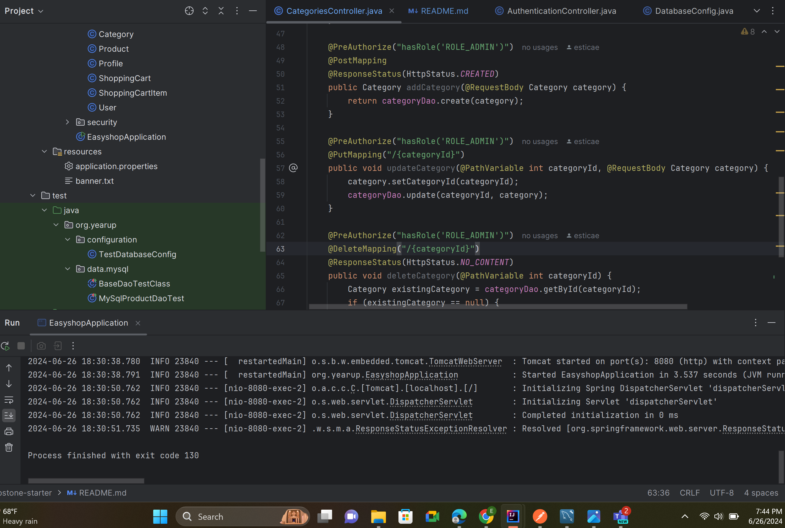

Project Title: Easy Shop - Online Shopping Cart Application
Description of the Project
Easy Shop is an online shopping cart application designed to simplify the process of browsing and purchasing products across various categories.
Users can easily add products to their cart, browse through different categories, and manage their shopping experience seamlessly.
Class Diagram

User Stories
List the user stories that guided the development of your application. Format these stories as: "As a [User], I want [some goal] so that [some reason]."

As a shopper, I want to easily add products to my cart from different categories, so that I can efficiently shop for items across various sections.
As a user, I want to navigate through product categories effortlessly, so I can find products of interest quickly.
Setup
Instructions on how to set up and run the project using IntelliJ IDEA.

Prerequisites
IntelliJ IDEA: Ensure you have IntelliJ IDEA installed, which you can download from here.
Java SDK: Make sure Java SDK is installed and configured in IntelliJ.
Running the Application in IntelliJ
Follow these steps to get your application running within IntelliJ IDEA:

Open IntelliJ IDEA.
Select "Open" and navigate to the directory where you cloned or downloaded the project.
After the project opens, wait for IntelliJ to index the files and set up the project.
Find the main class with the public static void main(String[] args) method.
Right-click on the file and select 'Run 'YourMainClassName.main()'' to start the application.
Technologies Used
Frontend: HTML, CSS, JavaScript
Backend: Java 17 (Spring Boot)
Database: MySQL
Demo
Include screenshots or GIFs that show your application in action. Use tools like Giphy Capture to record a GIF of your application.

Application Screenshot

Future Work
Outline potential future enhancements or functionalities you might consider adding:

Additional feature to be developed.
Improvement of current functionalities.
add a profile 
add a shopping cart
add new features

Resources
Spring Boot Documentation
MySQL Documentation
HTML, CSS, JavaScript Tutorials
Java Programming Tutorial
Effective Java

Team Members
Name 1 - Eugene Estica
Name 2 - EJ
Thanks
Express gratitude towards those who provided help, guidance, or resources:

Thank you to [Raymond] for continuous support and guidance.
A special thanks to all teammates for their dedication and teamwork.
I'll miss you mr.Teacher man 